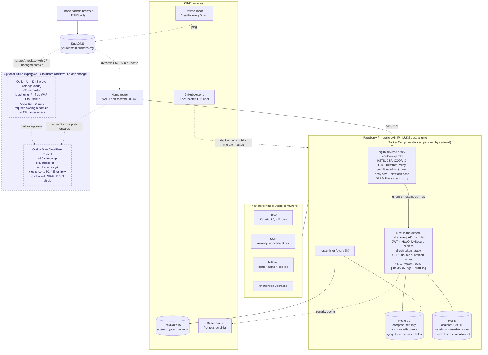

# QR Info — Securely running on the Pi

Single source of truth for the **architecture, threat model, deployment topology,
and phased implementation plan** for the production-grade reimplementation of
[../../app/](../../app/) under [../](../).

The `app/` project is the **functional reference** — same routes, same data
model, same UX. `secure-app/` is the **production-grade rewrite** with a
defensive architecture wrapped around it.

The reference architecture we're starting from is captured in
[claude-convs.md](claude-convs.md).

---

## Table of contents

1. [Goal](#goal)
2. [Reference architecture (input)](#reference-architecture-input)
3. [Proposed architecture (synthesis)](#proposed-architecture-synthesis)
4. [Deployment topology (diagram)](#deployment-topology-diagram)
5. [Threat model](#threat-model)
6. [Architecture decisions](#architecture-decisions)
7. [Deviations from the reference](#deviations-from-the-reference)
8. [Future expansion (Cloudflare)](#future-expansion-cloudflare)
9. [Strengths and weaknesses](#strengths-and-weaknesses)
10. [Working agreements](#working-agreements)
11. [Project layout](#project-layout)
12. [Implementation plan (phases)](#implementation-plan-phases)
13. [Subagent summary](#subagent-summary)
14. [Out of scope (v1)](#out-of-scope-v1)

---

## Goal

Reimplement the feature set delivered in [../../app/](../../app/) under [../](../)
so the same QR-registry / resolver / info-page / admin functionality can be
exposed to the **public internet** from the Raspberry Pi without owning a new
class of incidents.

---

## Reference architecture (input)

Captured in [claude-convs.md](claude-convs.md). Summary:

| Layer | Reference choice |
|-------|-----------------|
| Frontend | React + TypeScript (Vite static build) |
| Backend | Node + TypeScript (Express) |
| Reverse proxy | Nginx on the Pi |
| TLS | Let's Encrypt via certbot on the Pi |
| Internet exposure | DuckDNS + home-router port-forward 80/443 |
| DB | Postgres + Redis |
| Auth | JWT (`jsonwebtoken`) |
| Validation | zod |
| Headers | helmet |
| Rate limit | express-rate-limit |
| Stack glue | Docker Compose |
| Host hardening | UFW (22/80/443), SSH key-only |

That guide is sound and self-owned end-to-end. Two of its defaults are
**footguns** if applied literally and we explicitly improve them below
(see [Deviations from the reference](#deviations-from-the-reference)).

---

## Proposed architecture (synthesis)

We **base the deployment + infrastructure on the reference**
(Nginx + Let's Encrypt + DuckDNS + Postgres + Redis + Docker Compose + Pi
hardening) and **keep Next.js as the application framework** rather than
rewriting `app/` to Express + React. Every security control in the reference
maps cleanly onto Next.js (`helmet`-equivalent headers in `next.config.ts`, zod
in API routes, JWT middleware, `express-rate-limit`-style limiter, CSRF), so the
rewrite would burn engineering time without buying any security.

On top of that base we layer best-practice additions that the reference doesn't
spell out (JWT in HttpOnly cookies, refresh-token rotation, CSRF, audit log,
fail2ban on Nginx logs, restic off-Pi backups, Docker hardening). A future
Cloudflare expansion is designed in as **purely additive** — see
[Future expansion](#future-expansion-cloudflare).

| Layer | Decision |
|-------|----------|
| Framework | Next.js 16 (App Router, `src/app/`, TS strict) — **kept from `app/`** |
| Reverse proxy | Nginx (Docker Compose service) — TLS, headers, rate-limit |
| TLS | Let's Encrypt via certbot; auto-renewed |
| Internet exposure | DuckDNS + router port-forward 80/443 (today); Cloudflare optional later |
| DB | Postgres 16 (Drizzle ORM, migrations) |
| Cache / session | Redis 7 (sessions, rate-limit, refresh-token revocation list) |
| AuthN | JWT in HttpOnly+Secure cookies + refresh-token rotation; email allowlist |
| AuthZ | RBAC — `viewer` / `editor` |
| Validation | zod at every API boundary |
| Markdown | `remark` + `rehype-sanitize` strict allowlist |
| Logging | pino (JSON); separate security-event sink |
| Containers | Docker Compose stack, systemd supervises the compose unit |
| Backups | restic → Backblaze B2, `age`-encrypted |
| CI | GitHub Actions + self-hosted Pi runner |
| Host | UFW, SSH key-only on non-default port, fail2ban, unattended-upgrades, LUKS on data volume |

---

## Deployment topology (diagram)

Solid lines = today's traffic path. Dotted lines = control/management paths
(DNS updates, deploy, monitoring, log shipping, backups). Dashed-bordered
cluster at the bottom = future Cloudflare expansion, kept disconnected from the
live path on purpose — it's additive, not a prerequisite. The two future arrows
show the surgical changes needed when you flip the switch: swap DuckDNS for a
CF-managed domain (Option A), or close the router's port-forwards (Option B).



---

## Threat model

| Surface | Threats |
|---------|---------|
| Public resolver `/q/[code]` | Enumeration, scraping, DoS, malicious target URLs (open-redirect abuse), scan-counter inflation |
| Admin UI + API | Credential stuffing, session theft, CSRF, stored XSS via info-page body, IDOR, mass-assignment |
| Storage (Postgres + Redis) | Tampering, exfiltration, backup theft, corruption on power loss |
| Pi host | SSH brute-force, supply-chain (npm + Docker images), exposed ports, persistence after compromise |
| Build & deploy | Compromised runner token, unsigned commits, leaked secrets in git history |
| Home network | Router 0-day reachable via port-forward; ISP IP rotation lag |

Out of scope (v1): nation-state, physical access to the Pi, side-channel
attacks, ISP-level interception.

---

## Architecture decisions

### Network & transport (today)

- **DuckDNS** subdomain (`yourdomain.duckdns.org`) updated every 5 min by a cron
  job on the Pi so the public hostname follows ISP IP changes.
- **Home router** NATs 80 + 443 to the Pi's static LAN IP.
- **Nginx** on the Pi terminates TLS using a **Let's Encrypt** certificate
  (HTTP-01 via certbot's nginx plugin; falls back to DNS-01 via DuckDNS token if
  the ISP blocks inbound 80).
- **TLS policy:** `TLSv1.2` + `TLSv1.3` only; modern cipher suites; OCSP
  stapling on.
- **Security headers** added by Nginx and re-asserted by Next.js (defence in
  depth):
  - `Strict-Transport-Security: max-age=63072000; includeSubDomains; preload`
  - `Content-Security-Policy: default-src 'self'; script-src 'self' 'nonce-…';
    style-src 'self' 'nonce-…'; img-src 'self' data:; frame-ancestors 'none';
    base-uri 'self'; form-action 'self'`
  - `X-Content-Type-Options: nosniff`
  - `Referrer-Policy: no-referrer`
  - `Permissions-Policy: geolocation=(), microphone=(), camera=()`
  - `Cross-Origin-Opener-Policy: same-origin`
  - `Cross-Origin-Resource-Policy: same-origin`
- **UFW** denies inbound by default; allows SSH on the LAN interface only,
  plus 80 + 443 from anywhere.
- **Anti-slowloris / abuse caps in Nginx:** `client_body_timeout 10s`,
  `client_header_timeout 10s`, `client_max_body_size 256k` for `/api/*`,
  `keepalive_timeout 15s`.

### AuthN

- **JWT in HttpOnly + Secure cookies**, not `Authorization` headers and not
  `localStorage`. The reference says "use `jsonwebtoken`" without specifying
  storage; localStorage is the default pattern most tutorials show and it is
  XSS-vulnerable.
- **Access token:** short TTL (15 min), JWT signed with HS512, stored in
  cookie `qrinfo_at` — HttpOnly, Secure, SameSite=Strict, Path=/.
- **Refresh token:** longer TTL (7 days), opaque random 256-bit value, stored
  in cookie `qrinfo_rt` — HttpOnly, Secure, SameSite=Strict,
  Path=/api/auth/refresh, and **persisted server-side in Redis** so revocation
  works (logout, role change, suspected compromise).
- **Refresh-token rotation**: each refresh issues a new RT and revokes the old
  one; replay of an old RT triggers a session-wide revocation and an
  audit-log warning.
- **Password storage:** Argon2id (`memory=64MB, iterations=3, parallelism=1`,
  16-byte salt).
- **Email allowlist** in env (`ADMIN_EMAILS`) — only allowlisted addresses can
  log in. No public registration.
- **Bootstrap** via a single-use admin invite emitted by an `npm run grant`
  script, valid for 30 min.

### Session

- Access cookie 15 min; refresh cookie 7 days; **absolute session TTL 8 h** —
  past that, full re-login required.
- Idle TTL enforced server-side on every refresh (Redis tracks `lastSeen`).
- Cookies rotated on privilege change.
- **CSRF**: double-submit cookie. A non-HttpOnly cookie `qrinfo_csrf` plus the
  same token in an `X-CSRF-Token` header on every state-changing request.
  Server actions additionally verify `Origin` and `Sec-Fetch-Site`.

### AuthZ

- Two roles: `viewer` (read-only `/admin`) and `editor` (full CRUD). Resolver
  and info pages are public.
- Single `requireRole(role)` guard wraps every admin handler. No ambient
  auth, no per-handler ad-hoc checks.
- All authz denials log a security event with actor, route, reason.

### Storage

- **Postgres 16** in the Compose stack, bound to the internal Compose network
  only — port is never published to the host.
- **Drizzle ORM** for migrations and queries. Foreign keys enforced.
  `codes.code` and `pages.slug` unique-constrained.
  `codes.target_page_id` references `pages.id` with `ON DELETE RESTRICT`.
- **App role** with minimum grants (`SELECT, INSERT, UPDATE, DELETE` on data
  tables; no DDL, no superuser). Migrations run as a separate
  migrations-role with DDL grants — invoked by CI/deploy, not by the running
  app.
- **pgcrypto** used for sensitive fields if any land later (refresh-token
  hashes, user emails) so a DB dump leak is partially survivable.
- **Postgres data volume** is a Docker named volume backed by the Pi's
  **LUKS-encrypted** data partition.
- **Redis 7** in the Compose stack, bound to the internal network,
  `requirepass` enabled, `appendonly yes`. Used for sessions, the
  refresh-token revocation list, and the rate-limit counters.
- **Scan log** as a separate append-only table (rotated weekly, retained 90
  days) so the hot `codes` row isn't rewritten on every scan.

### Input validation & output handling

- **zod** schemas at every API boundary (request body, query, params). Reject
  on parse failure with a sanitized 400. No raw input echoed back.
- `code` slug: strict `/^[a-z0-9]{6,16}$/`.
- External target URLs: parsed via `new URL()`, must be `https:`, host must
  not be in a denylist (loopback, RFC1918, link-local, `.onion`, the Pi's own
  hostname — prevents redirect loops and SSRF-by-redirect).
- Info-page body: stored as Markdown, rendered through **`rehype-sanitize`**
  with a strict allowlist (no `<script>`, no inline `style`, no `javascript:`
  URLs, no `<iframe>` except a vetted image-embed shortcode). CSP nonce on
  every render.
- All HTML output through React's auto-escaping; no `dangerouslySetInnerHTML`
  except the sanitizer's output, and only there.
- Body size capped at Nginx (256 KB on `/api`, 1 MB on `/api/codes/.../qr`)
  and re-asserted in Next.js.

### Rate limiting & abuse

- **Edge layer (Nginx)** — `limit_req_zone` per IP:
  - `/q/[code]`: 30 req/min/IP, burst 60 nodelay
  - `/api/*`: 60 req/min/IP, burst 120 nodelay
  - `/api/auth/*`: 5 req/min/IP, burst 5
- **App layer (Next.js + Redis)** — sliding window for finer-grained policies:
  - `/api/auth/login`: 10 attempts / hour / account (bound to email, not IP)
  - Authenticated routes: 600 req/min/user
- Scan counter is incremented via a **debounced worker queue** (counter on
  `codes` flushed every 10 s) so a flood can't pin the DB writer.
- 429s carry `Retry-After`.
- Trust-proxy: Next.js reads the client IP from `X-Forwarded-For` (today's
  reference Nginx setup) — *replace with* `CF-Connecting-IP` if/when
  Cloudflare lands. Reject requests on `/api/*` that arrive with no proxy
  headers in prod (means they bypassed Nginx).

### Secrets

- **Never in git.** `.env.production` lives in `/etc/qrinfo/qrinfo.env`,
  owned root, mode `0640`, group `qrinfo`. Loaded by Docker Compose via
  `env_file:` or by the systemd unit's `EnvironmentFile=`.
- Long-lived secrets generated **on the Pi during install** and never logged:
  `AUTH_SECRET` (JWT signing), `POSTGRES_PASSWORD`, `REDIS_PASSWORD`,
  `DUCKDNS_TOKEN`, `RESTIC_PASSWORD`, `AGE_KEY` (backup encryption).
- **`sops` + `age`** toolchain configured for any secret that must be
  committed (none in v1).
- **`gitleaks`** runs on every CI push (fails the build on a hit) and against
  the full history on a weekly schedule.
- `.gitignore` covers `.env*`, `*.db`, `*.db-wal`, `*.db-shm`,
  `drizzle/.cache`, `cloudflared/*.json`.

### Logging, metrics, alerting

- Structured JSON logs via **`pino`** → container stdout → Docker logging
  driver → journald → rotated.
- **Redaction** at the logger level for `authorization`, `cookie`, `password`,
  `*.token`, `*.secret`.
- **Security-event log** is a separate sink (`/var/log/qrinfo/security.log`,
  append-only, mounted into the Next.js container read-write, root-owned on
  the host) for: login success/failure, role denial, rate-limit trip ≥3 in
  10 min, admin mutations, sanitizer rejections, deploy events.
- Tail-shipped to Better Stack (or Grafana Cloud free tier) via Vector
  running on the Pi.
- **`/healthz`** returns `{ ok, db, redis, version }`. No auth, no internals.
- **UptimeRobot** pings `/healthz` every 5 min.
- **Alerts** on: 5xx burst, login-failure burst, healthz down,
  disk > 80%, certbot renewal failure.

### Process & host hardening

- **Docker Compose** stack supervised by a systemd unit `qrinfo.service` so
  the stack starts on boot and restarts on crash. The systemd unit itself
  runs with `NoNewPrivileges=true`, `ProtectSystem=strict`,
  `ProtectHome=true`, `PrivateTmp=true`,
  `ReadWritePaths=/var/lib/qrinfo /var/log/qrinfo`.
- **Per-container hardening** in `docker-compose.yml`:
  - `read_only: true` on Nginx + Next.js, with explicit `tmpfs:` mounts
  - `cap_drop: [ALL]` everywhere; `cap_add` only where strictly needed
  - `security_opt: [no-new-privileges:true]`
  - non-root user inside every image (`USER node` etc.)
  - resource caps: `mem_limit: 512m`, `pids_limit: 256`
  - no `--privileged`, no host-network, no `/var/run/docker.sock` mounts
- **Image hygiene:** distroless or `-slim` bases; `npm ci --omit=dev` in the
  build stage; multi-stage builds; image-pinned digests in compose; Trivy
  scan in CI.
- **Pi OS:**
  - `unattended-upgrades` enabled, security updates auto-applied
  - SSH: key-only, non-default port, root login disabled, `AllowUsers` limited
  - `fail2ban` jails: `sshd`, `nginx-http-auth`, `nginx-noscript`, app's
    security log (custom filter on repeated 401/403)
  - UFW: deny inbound default; allow LAN-SSH; allow 80, 443
  - LUKS encryption on the SD card data partition (one-time install step)

### Build & deploy

- **GitHub Actions** self-hosted runner on the Pi (same as the teacher
  project), PAT restricted to this repo only.
- **CI gates on every PR** (`.github/workflows/ci.yml`):
  - `npm ci`
  - `npm run lint` (ESLint + `eslint-plugin-security` +
    `eslint-plugin-no-unsanitized`)
  - `tsc --noEmit`
  - `npm test`
  - `npm audit --omit=dev --audit-level=high` (fail on high+)
  - `gitleaks detect`
  - `drizzle-kit check` — migrations apply cleanly to a fresh DB
  - `trivy image` scan of the built containers
  - `npm run build`
- **Branch protection** on `main`: require PR, require signed commits,
  require CI green.
- **Deploy on push to `main`** (`.github/workflows/deploy.yml`,
  `[self-hosted, pi]`):
  - `git pull`
  - `docker compose build --pull`
  - run pending Drizzle migrations
  - `docker compose up -d`
  - `curl /healthz` and one resolver — abort & roll back on failure

### Backups & recovery

- **`restic`** snapshots of the Postgres dump + `/etc/qrinfo/` to
  **Backblaze B2** every 6 hours, encrypted with an `age` key that exists
  only in a password manager and one offline copy.
- Retention: 7 daily, 4 weekly, 6 monthly.
- **Quarterly restore drill** documented as a runbook — a backup that has
  never been restored is not a backup.

---

## Deviations from the reference

| Reference default | Our choice | Why |
|------------------|------------|-----|
| Express + React (Vite) | **Next.js** (kept from `app/`) | Avoids rewriting working code; every security control maps 1:1; reduces operational surface to one Node process |
| `jsonwebtoken` (storage unspecified) | **JWT in HttpOnly+Secure cookies + refresh-token rotation in Redis** | Default `localStorage` pattern is XSS-vulnerable; cookies need CSRF — we add double-submit |
| `helmet()` defaults | **Stricter CSP** with nonces, COOP, CORP, Permissions-Policy | Helmet defaults are baseline; modern apps need explicit script-src nonces |
| CORS `origin: ALLOWED_ORIGIN` | Same, **plus** server-side `Origin` + `Sec-Fetch-Site` checks on state-changing routes | CORS alone doesn't stop CSRF on same-origin form posts |
| `npm audit` "regularly" | **`npm audit --audit-level=high` as CI gate, weekly gitleaks history scan, Trivy on images** | Make it not-optional |
| DB creds inline in `docker-compose.yml` env | **Env from `/etc/qrinfo/qrinfo.env`** root-owned, mode 0640, loaded by Compose `env_file:` | Stops accidental commits and casual shell-history leaks |
| No explicit backup story | **`restic` → B2, `age`-encrypted, quarterly restore drill** | "Backups" without "restore drill" is wishful thinking |
| `UFW: allow ssh` | **SSH on non-default port, LAN-interface-only, key-only, fail2ban** | Default-port SSH on the internet is constantly probed |
| Implicit: Docker Compose with defaults | **`read_only`, `cap_drop: ALL`, non-root user, `no-new-privileges`, pinned digests, Trivy scan** | Compose defaults give containers more privilege than they need |
| No audit log mentioned | **Separate `audit_log` table + append-only security-event log file** | Required to investigate after the fact |
| Implicit: visitor IP from `X-Forwarded-For` | **Trust only Nginx-injected headers; reject `/api/*` requests with missing proxy headers in prod** | Stops bare-IP requests bypassing edge controls |

---

## Future expansion (Cloudflare)

The Cloudflare paths are **additive** and require zero changes to the app, DB,
or auth layer. The only application-level hook is reading the real client IP
from `CF-Connecting-IP` instead of `X-Forwarded-For` in the rate-limit and
audit-log middleware — a one-line change.

| Option | Effort | Effect | Prerequisite |
|--------|--------|--------|--------------|
| **A. Cloudflare DNS proxy (orange cloud)** | ~30 min | Hides home IP; free WAF; DDoS shield; free TLS at edge; keeps port-forward | Own a domain on CF nameservers (DuckDNS can't be proxied) |
| **B. Cloudflare Tunnel** | ~45–60 min | All of A **plus** closes ports 80/443 entirely (no inbound) | Same as A; plus `cloudflared` running as a service on the Pi |

When Option A lands:
- Swap the A record from DuckDNS to a CF-managed apex/CNAME.
- Restrict Nginx `allow`/`deny` to Cloudflare's published IP ranges.
- Switch to a Cloudflare Origin Certificate (15-year) or keep Let's Encrypt.

When Option B lands (recommended end-state):
- Install `cloudflared` as a systemd service, authenticate against the CF
  account, route the hostname to `http://localhost:80`.
- Remove the home-router port-forward; UFW deny inbound 80/443 from the
  internet (LAN access still fine).
- Cert renewal stops needing inbound port 80.

---

## Strengths and weaknesses

### Strengths
- **Self-owned end-to-end** — no third-party SaaS in the request path today;
  Cloudflare is optional, not required.
- **Vendor-neutral and portable** — Docker Compose runs on any Linux box;
  Postgres dump migrates anywhere.
- **Transparent** — every layer (Nginx, Next.js, Postgres, Redis, fail2ban)
  is editable by the operator. Strong learning value.
- **Defence in depth** — Nginx + Next.js both assert headers and rate-limits;
  Postgres + Redis are network-isolated and password-protected; containers
  run read-only, dropped-caps, non-root.
- **Reuses the existing `app/` codebase** rather than rewriting it.
- **Backups are real** — encrypted, off-site, restore-drilled.
- **Cloudflare-ready** — when you want edge protection, the upgrade is small
  and reversible.

### Weaknesses (acknowledged trade-offs)
- **Home IP exposed via DuckDNS** until/unless Option A is adopted.
- **Inbound ports 80/443 open** on the home router. Mitigations: Nginx is the
  only listener, fail2ban catches abuse, security headers are strict, body
  size and timeouts are capped — but a 0-day in Nginx or OpenSSL is reachable.
- **No DDoS protection** today — volumetric attacks land on the home ISP
  link. Mitigation: Cloudflare Option A is the answer.
- **Let's Encrypt HTTP-01 needs port 80 reachable.** Some ISPs block 80;
  fallback path is DNS-01 via DuckDNS API.
- **Postgres + Redis on a Pi 4** uses real RAM and stresses the SD card.
  Mitigation: budget for an SSD if the Pi's data volume grows.
- **More moving parts than SQLite-on-Next.js**: Docker daemon, Postgres,
  Redis, certbot — each a CVE channel. Mitigation: unattended-upgrades +
  pinned digests + Trivy in CI.
- **DynDNS lag** — up to 5 min of wrong-IP after ISP rotation. Acceptable for
  this app.

---

## Working agreements

- **Keep this plan's progress up to date while executing** — tick checkboxes
  as work lands; annotate deltas inline. Same rule as
  [../../basic_plan.md](../../basic_plan.md).
- **Subagents in parallel for independent work.** Phases 11–16 (Compose,
  Nginx, host hardening, DNS+TLS, backups, CI) are largely independent
  surfaces and should be dispatched as parallel agents in a single batch once
  the app itself is ready. Phases that touch the same files (DB layer, auth,
  routes) stay serial.
- **Lift from `app/` only when the security shape is unchanged.** Resolver
  branching, QR-image generation, admin form UI — copy. DB layer, validation,
  auth wrapping, body rendering, every API handler's outer wrapper — rewrite.
- **Tests before integration.** Each phase adds at least the negative cases
  (unauth, malformed input, rate-limit hit) in addition to the happy path.

---

## Project layout

```
qrinfo/
  app/                        # reference implementation (do not modify)
  secure-app/
    src/
      app/                    # Next.js routes (mirrors app/app/ + auth additions)
        (public)/             # resolver, info, examples
          q/[code]/page.tsx
          info/[slug]/page.tsx
          examples/page.tsx
        (admin)/              # gated routes — layout enforces auth
          admin/page.tsx
          admin/codes/...
          admin/pages/...
        api/
          auth/[...nextauth]/route.ts
          codes/...
          pages/...
          health/route.ts     # /healthz
      lib/
        db/                   # drizzle client + migrations
          schema.ts
          client.ts
          migrate.ts
        auth/                 # jwt sign/verify, refresh rotation, requireRole
        redis.ts              # ioredis client (sessions, rate-limit, RT list)
        validate.ts           # zod schemas
        rate-limit.ts         # app-layer limiter
        logger.ts             # pino + security-event sink
        qr.ts
        sanitize.ts           # rehype-sanitize allowlist
        env.ts                # zod-parsed process.env
      middleware.ts           # CSRF, security headers, auth redirect
    drizzle/                  # generated migration SQL
    deploy/
      docker-compose.yml      # nginx + app + postgres + redis
      Dockerfile.app          # multi-stage, non-root, read-only
      nginx/
        nginx.conf
        snippets/             # tls, headers, rate-limit zones
      qrinfo.service          # systemd unit supervising compose
      ufw.rules
      duckdns/duck.sh
      restic.env.example
      install.sh              # generates secrets, lays out /etc/qrinfo/
    plans/                    # this folder
    tests/
    README.md
```

---

## Implementation plan (phases)

---

### Phase 0 — Architecture & threat-model docs
> Goal: lock the architecture in writing before code is written.

**Suggested agent:** `claude` (Opus 4.7)

- [x] [secure-architecture sections of this doc](#architecture-decisions) — written
- [x] Deployment topology diagram (inline above)
- [x] [claude-convs.md](claude-convs.md) — reference architecture captured
- [ ] `plans/runbooks/` — operational runbooks:
  - [ ] `incident-response.md` — credential leak, abuse, certbot failure
  - [ ] `backup-restore.md` — restic restore drill (run quarterly)
  - [ ] `key-rotation.md` — JWT signing key, OAuth secrets, age key
  - [ ] `cloudflare-cutover.md` — Option A and B step-by-steps

---

### Phase 1 — Scaffold & strict baseline
> Goal: a Next.js project that boots, with security-first defaults wired in from line one.

**Suggested agent:** `claude` (Sonnet 4.6)

- [ ] `npm create next-app` in `secure-app/` with TS, Tailwind, ESLint, App Router, `src/`
- [ ] `next.config.ts`: `output: 'standalone'`, strict `headers()` block (CSP, HSTS,
      X-Content-Type-Options, Referrer-Policy, Permissions-Policy, COOP, CORP)
- [ ] `tsconfig.json`: `strict: true`, `noUncheckedIndexedAccess: true`,
      `exactOptionalPropertyTypes: true`
- [ ] ESLint: add `eslint-plugin-security`, `eslint-plugin-no-unsanitized`,
      `@typescript-eslint/no-floating-promises` set to error
- [ ] `src/lib/env.ts` — Zod schema for all required env vars; fail fast on boot
- [ ] `src/lib/logger.ts` — pino JSON logger; redact known sensitive keys
- [ ] `.env.example` with every variable documented (no real values)
- [ ] `.gitignore` covers `.env*`, `*.db*`, `drizzle/.cache`, `cloudflared/*.json`
- [ ] Verify `npm run dev`, `npm run build`, `npm run lint` all pass on empty app

---

### Phase 2 — Storage: Postgres + Drizzle + Redis
> Goal: durable, integrity-checked storage and a session/cache layer.

**Suggested agent:** `claude` (Sonnet 4.6)

- [ ] Install `drizzle-orm`, `drizzle-kit`, `pg`, `ioredis`
- [ ] `src/lib/db/schema.ts` — tables: `codes`, `pages`, `users`,
      `refresh_tokens`, `audit_log`, `scan_log`
- [ ] Unique constraints on `codes.code` and `pages.slug`; FK
      `codes.target_page_id → pages.id` with `ON DELETE RESTRICT`
- [ ] `src/lib/db/client.ts` — pooled pg client; reads `DATABASE_URL` from env
- [ ] `src/lib/db/migrate.ts` — runs pending migrations on boot (idempotent)
- [ ] `src/lib/redis.ts` — ioredis client; `requirepass` from env; TLS off
      (compose-internal network)
- [ ] Seed script writes the same two demo codes + one info page that `app/`
      ships with
- [ ] Local-dev compose-lite: `postgres` + `redis` only, for `npm run dev`

---

### Phase 3 — AuthN / AuthZ: JWT-cookie + refresh rotation
> Goal: admin surface is unreachable without a valid, allowlisted, role-checked identity.

**Suggested agent:** `claude` (Sonnet 4.6)

- [ ] Install `jsonwebtoken`, `argon2`, `cookie`
- [ ] `src/lib/auth/jwt.ts` — sign/verify access tokens (HS512, 15 min)
- [ ] `src/lib/auth/refresh.ts` — opaque 256-bit RT, stored hashed in Redis
      `qrinfo:rt:<jti>`; rotation on every refresh; replay detection
- [ ] `src/lib/auth/password.ts` — Argon2id with the parameters in the
      architecture spec
- [ ] `src/lib/auth/requireRole.ts` — returns session or throws 401/403
- [ ] `src/app/api/auth/login/route.ts` — email + password, rate-limited
      10/h/email, Argon2id verify, allowlist check
- [ ] `src/app/api/auth/refresh/route.ts` — RT rotation
- [ ] `src/app/api/auth/logout/route.ts` — revokes RT in Redis
- [ ] `scripts/grant.ts` — `npm run grant <email>` issues a single-use,
      30-min invite link for first admin
- [ ] `middleware.ts` — unauthenticated `/admin/**` → `/login`; injects CSP nonce
- [ ] Tests: unauth → 302; wrong-role → 403; expired AT → 401; replay of old
      RT → session revoked + audit warning

---

### Phase 4 — Public resolver `/q/[code]`
> Goal: lift from `app/app/q/[code]/page.tsx`, add proper 404 status + rate-limit hook + scan-log.

**Suggested agent:** `claude` (Sonnet 4.6)

- [ ] Port the resolver to use the Drizzle query layer
- [ ] **Fix status codes**: missing/disabled → **HTTP 404** (not 200 as in
      `app/`), same Swedish fallback page
- [ ] Per-IP rate limit applied before DB lookup (Phase 8 stub)
- [ ] External redirect: re-validate target URL is `https:`, not a denylisted
      host; log + 410 if a previously-saved URL now fails validation
- [ ] Scan counter: enqueue an append to `scan_log`; counter on `codes`
      updated by a debounced background flush
- [ ] Tests: external 302, internal render, missing 404, disabled 404,
      malformed slug 400

---

### Phase 5 — Internal info pages `/info/[slug]`
> Goal: same UI as `app/`, but body is sanitized Markdown.

**Suggested agent:** `claude` (Sonnet 4.6)

- [ ] Port the page layout (mobile-first, matches `app/`)
- [ ] `src/lib/sanitize.ts` — `rehype-sanitize` schema: allow headings,
      paragraphs, lists, links (rel="noopener nofollow", target="_blank"),
      inline code, blockquotes. **Deny** `<script>`, `<iframe>`, `<style>`,
      event handlers, `javascript:` URLs, `data:` URLs except `data:image/...`
- [ ] Render through `remark` → `rehype` → `rehype-sanitize` → `rehype-react`
- [ ] CSP nonce threaded through SSR
- [ ] 404 for unknown slugs
- [ ] Tests: malicious payloads (XSS strings, ``, `javascript:`
      href) are stripped; benign Markdown renders

---

### Phase 6 — Admin CRUD (codes + pages)
> Goal: parity with `app/admin/**`, behind auth, with CSRF + audit + validation.

**Suggested agent:** `claude` (Sonnet 4.6)

- [ ] Port the admin layout + list/form components
- [ ] Server actions (preferred over API routes for forms) with `Origin` check
- [ ] Every state-changing handler wrapped by `requireRole('editor')`
- [ ] Every input parsed by a Zod schema; reject on parse failure with a 400
      + sanitized message (no echo of raw input)
- [ ] CSRF: double-submit cookie for non-server-action routes
- [ ] `audit_log` row written on every create / update / delete with actor,
      target, diff summary, IP, timestamp
- [ ] Delete protection: cannot delete a page referenced by an internal code
      (FK enforces it; UI returns 409 with the referencing code names)
- [ ] Tests: unauth → 302; CSRF mismatch → 403; bad slug → 400; happy path
      200; audit row present after every mutation

---

### Phase 7 — QR generation
> Goal: lift verbatim from `app/lib/qr.ts` + `app/app/api/codes/[id]/qr/route.ts`.

**Suggested agent:** `claude` (Sonnet 4.6)

- [ ] Copy `lib/qr.ts` and the QR API route as-is
- [ ] Gate the QR download route behind `requireRole('viewer')`
- [ ] `QR_BASE_URL` from validated env
- [ ] Tests: PNG + SVG returned with right content-type; unauth → 302

---

### Phase 8 — Rate limiting & abuse handling
> Goal: bounded resource consumption per IP and per code.

**Suggested agent:** `claude` (Sonnet 4.6)

- [ ] `src/lib/rate-limit.ts` — Redis-backed sliding window
- [ ] App-layer limits (in addition to Nginx zones from Phase 12):
  - `/api/auth/login`: 10 / h / email
  - Authenticated routes: 600 r/min/user
- [ ] Returns 429 + `Retry-After`; logs a security event when an IP trips the
      limit ≥3 times in 10 min
- [ ] Trust-proxy: read `X-Forwarded-For` (today's Nginx) — TODO comment for
      `CF-Connecting-IP` switch if/when Cloudflare lands. Reject `/api/*`
      requests missing proxy headers in prod (means they bypassed Nginx)
- [ ] Tests: 31st request inside 1 min returns 429

---

### Phase 9 — Logging, metrics, alerting
> Goal: a clear picture of what's happening, with alerts when it stops being normal.

**Suggested agent:** `claude` (Sonnet 4.6)

- [ ] `pino` JSON logger with redaction of `authorization`, `cookie`,
      `password`, `*.token`, `*.secret`
- [ ] Separate security-event sink (`/var/log/qrinfo/security.log`) for:
      login success/failure, role denial, rate-limit trip, admin mutations,
      sanitizer rejections
- [ ] `/healthz` returns `{ ok, db, redis, version }` — no auth, no internals
- [ ] Vector config on the Pi to tail-ship logs to Better Stack or Grafana
      Cloud
- [ ] UptimeRobot or healthchecks.io ping the public hostname every 5 min
- [ ] Alert rules: 5xx burst, login-failure burst, healthz down, disk > 80%,
      certbot renewal failure

---

### Phase 10 — Secrets management
> Goal: secrets never leave the machine they were generated on.

**Suggested agent:** `claude` (Sonnet 4.6)

- [ ] `deploy/install.sh` — creates `/etc/qrinfo/qrinfo.env` (root:qrinfo,
      0640), generates `AUTH_SECRET`, `POSTGRES_PASSWORD`, `REDIS_PASSWORD`,
      `AGE_KEY` with `openssl rand`
- [ ] Required vars documented in `.env.example`: `DATABASE_URL`,
      `REDIS_URL`, `AUTH_SECRET`, `ADMIN_EMAILS`, `QR_BASE_URL`,
      `DUCKDNS_DOMAIN`, `DUCKDNS_TOKEN`, `RESTIC_REPOSITORY`,
      `RESTIC_PASSWORD_FILE`
- [ ] `sops` + `age` configured for any secret that ever needs to be committed
      (none in v1) — toolchain only
- [ ] CI gate: `gitleaks` runs on every push; PR fails on detection
- [ ] Weekly scheduled CI job: `gitleaks detect --log-opts="--all"` against
      full history

---

### Phase 11 — Docker Compose stack
> Goal: nginx + app + postgres + redis run as a hardened compose unit.

**Suggested agent:** `claude` (Sonnet 4.6). **Parallelisable** with phases 12–16.

- [ ] `deploy/docker-compose.yml` with services: `nginx`, `app`, `postgres`,
      `redis`
- [ ] `deploy/Dockerfile.app` — multi-stage; build with full node image, run
      on `node:20-slim` or distroless; `USER node`; no root
- [ ] Per-service hardening: `read_only`, `cap_drop: [ALL]`,
      `security_opt: [no-new-privileges:true]`, `mem_limit`, `pids_limit`
- [ ] `tmpfs:` mounts where the app needs writable scratch (`/tmp`, Next.js
      cache)
- [ ] Image digests pinned (no floating tags in compose)
- [ ] Postgres + Redis bound to the internal Compose network only
- [ ] Volumes: named volume for Postgres data; bind-mount
      `/var/log/qrinfo/` for security log
- [ ] `deploy/qrinfo.service` — systemd unit that runs
      `docker compose up -d` on boot; restart on failure

---

### Phase 12 — Nginx config (TLS, headers, rate-limit, caps)
> Goal: the single public-internet listener does its job and only its job.

**Suggested agent:** `claude` (Sonnet 4.6). **Parallelisable** with phases 11, 13–16.

- [ ] `deploy/nginx/nginx.conf` — TLS server block, HTTP→HTTPS redirect, SPA
      fallback, `/api` proxy
- [ ] `snippets/tls.conf` — TLSv1.2+1.3, modern ciphers, OCSP stapling
- [ ] `snippets/headers.conf` — HSTS, CSP (with nonce placeholder), X-CTO,
      COOP, CORP, Referrer-Policy, Permissions-Policy
- [ ] `snippets/limits.conf` — `client_body_timeout`, `client_header_timeout`,
      `client_max_body_size`, `keepalive_timeout`
- [ ] `snippets/rate-limit.conf` — `limit_req_zone` for resolver, api, auth
- [ ] Logs to a path readable by the host (so fail2ban + Vector can tail them)
- [ ] Test config: `nginx -t` in CI; `securityheaders.com` smoke test in the
      deploy step

---

### Phase 13 — Pi host hardening
> Goal: the OS underneath the stack is itself defensible.

**Suggested agent:** `claude` (Sonnet 4.6). **Parallelisable** with phases 11, 12, 14–16.

- [ ] Dedicated `qrinfo` user (no shell, `--system`)
- [ ] `/var/lib/qrinfo/` and `/var/log/qrinfo/` created, owned `qrinfo:qrinfo`,
      `0750`
- [ ] **LUKS** encryption on the SD card data partition (one-time, documented)
- [ ] `unattended-upgrades` enabled
- [ ] SSH: key-only, non-default port, root login disabled, `AllowUsers`
      limited
- [ ] `fail2ban` jails: sshd, nginx-http-auth, nginx-noscript, custom filter
      on app security log
- [ ] UFW: deny inbound default; allow LAN-SSH on the non-default port;
      allow 80, 443; outbound unrestricted
- [ ] `deploy/ufw.rules` committed
- [ ] Verify with `lynis audit system` — record findings

---

### Phase 14 — DuckDNS + Let's Encrypt
> Goal: public hostname stays current; HTTPS just works and renews itself.

**Suggested agent:** `claude` (Sonnet 4.6). **Parallelisable** with phases 11–13, 15, 16.

- [ ] Create DuckDNS subdomain; token in `/etc/qrinfo/qrinfo.env`
- [ ] `deploy/duckdns/duck.sh` + cron entry (every 5 min)
- [ ] Configure home-router port-forward 80, 443 → Pi static LAN IP
      (document in README; can't be automated)
- [ ] `certbot --nginx -d <duckdns-name>` first run; auto-renew via systemd
      timer; verify with `certbot renew --dry-run`
- [ ] Fallback DNS-01 via DuckDNS API documented (for ISPs blocking 80)
- [ ] Smoke test: phone on mobile data resolves the hostname and gets HTTPS

---

### Phase 15 — Backups & restore drill
> Goal: a backup that has been restored at least once.

**Suggested agent:** `claude` (Sonnet 4.6). **Parallelisable** with phases 11–14, 16.

- [ ] `age` keypair generated; private key copied **off the Pi** to two
      locations (password manager + offline)
- [ ] `restic` configured against Backblaze B2 bucket; password in
      `/etc/qrinfo/`
- [ ] Systemd timer: snapshot `pg_dump` + `/etc/qrinfo/` every 6 h
- [ ] Retention: 7 daily, 4 weekly, 6 monthly
- [ ] `deploy/restic.env.example` documents the env vars
- [ ] **Restore drill**: spin up a second Pi (or a VM), restore the latest
      snapshot, boot the stack against it, verify a known code resolves.
      Document in `plans/runbooks/backup-restore.md`
- [ ] Calendar reminder for quarterly drill

---

### Phase 16 — CI/CD pipeline with security gates
> Goal: every merge to `main` is auto-deployed only after passing security checks.

**Suggested agent:** `claude` (Sonnet 4.6). **Parallelisable** with phases 11–15.

- [ ] `.github/workflows/ci.yml` runs on every PR:
  - `npm ci`
  - `npm run lint` (ESLint + security plugins)
  - `tsc --noEmit`
  - `npm test`
  - `npm audit --omit=dev --audit-level=high`
  - `gitleaks detect`
  - `drizzle-kit check` — migrations apply cleanly to a fresh DB
  - `trivy image` scan of built containers
  - `npm run build`
- [ ] `.github/workflows/deploy.yml` on push to `main`, on `[self-hosted, pi]`:
  - `git pull`
  - `docker compose build --pull`
  - run migrations
  - `docker compose up -d`
  - curl `/healthz` and one resolver — abort & rollback on failure
- [ ] Branch protection on `main`: require PR, require signed commits,
      require CI green
- [ ] Self-hosted runner uses a PAT scoped only to this repo

---

### Phase 17 — Security review & demo
> Goal: confirm the architecture holds up under review, then ship.

**Suggested agent:** `claude` with `/security-review` and `/verify`

- [ ] Run `/security-review` on the full diff; triage findings into fix /
      accept / defer
- [ ] Run `/verify` end-to-end: log in, create a code, scan it from a phone,
      edit the page, see audit-log row
- [ ] Manual checklist:
  - CSP headers verified (`securityheaders.com` A+)
  - HSTS preload-list eligibility checked
  - No unexpected port reachable from the public internet (`nmap` from
    outside)
  - Rate limits actually trip at the documented thresholds
  - `gitleaks` clean against full history
  - Restore drill performed and documented
- [ ] Write a one-page **incident response runbook** in `plans/runbooks/`
- [ ] Tag `v1.0.0`

---

## Subagent summary

| Phase | Agent | Reason |
|-------|-------|--------|
| 0 — Architecture + diagrams | Opus 4.7 | Whole-system reasoning, Mermaid authoring |
| 1 — Scaffold | Sonnet 4.6 | Standard project setup |
| 2 — Storage | Sonnet 4.6 | Drizzle schema + Redis client |
| 3 — Auth | Sonnet 4.6 | JWT-cookie + RT rotation + Argon2id |
| 4 — Resolver | Sonnet 4.6 | Port from `app/`, add rate-limit hook |
| 5 — Info pages | Sonnet 4.6 | Sanitizer integration |
| 6 — Admin CRUD | Sonnet 4.6 | Auth wrapper + CSRF + audit |
| 7 — QR | Sonnet 4.6 | Lift from `app/` |
| 8 — Rate limit | Sonnet 4.6 | Redis sliding window |
| 9 — Logging | Sonnet 4.6 | pino + sinks + Vector |
| 10 — Secrets | Sonnet 4.6 | Install script + sops setup |
| **11–16 — Compose / Nginx / Pi / DNS+TLS / backups / CI** | **6× Sonnet 4.6 in parallel** | Independent surfaces; dispatch as one batch |
| 17 — Security review | Sonnet 4.6 + `/security-review` + `/verify` | Final audit |

---

## Out of scope (v1)

- Multi-tenant — single Pi, one operator
- Image uploads on info pages (deferred; sanitizer schema is ready when this
  lands)
- Public read API — only the resolver is public
- HSM-backed key storage — `age` private key in a password manager is
  sufficient
- Real-time scan analytics dashboard — `scan_log` is queryable; dashboards
  come later
- Passkey / WebAuthn — JWT is the v1 auth; passkeys can be added later as
  an additional provider without changing the cookie/session layer
