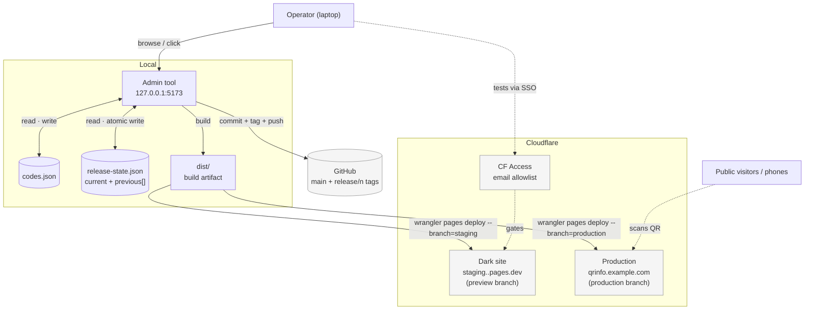

# QR Info Static — Admin Tool Plan

## Project Overview

A **local, single-operator admin tool** for managing the static QR site
defined in [static-site.md](static-site.md). Runs on the operator's laptop,
not in production. Opens a browser to a tiny UI where codes can be added,
edited, enabled/disabled, then promoted through a **dark-site preview** to
a **public production site** with explicit `current` / `previous` pointers
and stack-based rollback. The static site itself remains exactly what it
is: HTML + `_redirects` + QR images on a CDN. The tool generates those
artifacts and drives the release flow; it never runs in production.

### Where this sits in the system

- [../../basic_plan.md](../../basic_plan.md) — Pi/Next.js (dynamic, full
  admin UI in browser, hosted on the Pi)
- [../../secure-app/plans/securely-running-on-pi.md](../../secure-app/plans/securely-running-on-pi.md)
  — production-hardened rewrite of the Pi version
- [static-site.md](static-site.md) — the static CDN site (what gets deployed)
- **this plan** — the local tool + release flow that drives the static site

---

## Release flow

### Forward (deploy)

1. **Edit on `main`.** Operator changes `codes.json` via the admin tool
   (or directly).
2. **Preview to the dark site.** `npm run preview` builds `main` and
   deploys it to a **non-production** Cloudflare Pages branch
   (`staging`), reachable only at a stable URL gated by **Cloudflare
   Access** (operator's email allowlist). Production is untouched.
3. **Test on the dark URL** — scan a QR, click through, verify the diff
   behaves correctly. Iterate freely; re-running `preview` overwrites the
   dark deploy without affecting production.
4. **Tag.** `npm run tag <n>` runs `git tag release/<n> HEAD &&
   git push --tags`. The tag is the immutable release point.
5. **Deploy.** `npm run deploy <n>` promotes `release/<n>` to the
   public production site:
   - Build from the tag
   - `wrangler pages deploy dist/ --branch=production`
   - **Atomically** (steps 5–6 of the user's flow): push the previous
     `current` entry onto the `previous` stack, set `current` to the new
     release, write `release-state.json` via temp-rename, commit + push

### Rollback

1. **Pop** the top of the `previous` stack — call that entry `m`. The
   `previous` pointer (= `previous[0]`) now refers to what was index 1.
2. **Set** `current = m`.
3. **Deploy** `m`'s build to the public production site
   (`wrangler pages deploy dist/ --branch=production`).

All three rollback steps are transactional: `release-state.json` is only
mutated *after* wrangler confirms success. If wrangler fails, the stack is
untouched and the operator can retry. The (very narrow) window between
"wrangler returned" and "JSON written" is closed via atomic temp-rename.

### Semantics summary

| Action | Before | After |
|--------|--------|-------|
| `deploy A` (initial) | current=∅, prev=[] | current=A, prev=[] |
| `deploy B` | current=A, prev=[] | current=B, prev=[A] |
| `deploy C` | current=B, prev=[A] | current=C, prev=[B, A] |
| `rollback` | current=C, prev=[B, A] | current=B, prev=[A] |
| `rollback` | current=B, prev=[A] | current=A, prev=[] |
| `rollback` (empty) | current=A, prev=[] | **error** |
| `deploy D` (after stacks) | current=A, prev=[] | current=D, prev=[A] |

Notes:
- The old `current` is **discarded from state** on rollback — only added
  to the stack on a forward `deploy`. (Matches the user's spec; a popped
  entry "out" is gone from the live model.)
- The **git tag remains** for anything ever-deployed, so an operator can
  always `npm run deploy release/<any>` to bring an older state back.
- `deploy` of a tag that's already in `previous` first removes it from
  the stack, then makes it `current`, then pushes the old `current` on
  top — no duplicates, no zombie entries.

---

## Topology



- Two CF Pages branches: `production` is the public site; `staging` is
  the dark preview. Both come from the same CF project.
- CF Access enforces operator-only reach to the dark URL.
- Git holds the immutable release tags; `release-state.json` is the live
  cursor over them.

---

## Architecture decisions

| Concern | Choice | Why |
|---------|--------|-----|
| Source of truth for codes | `codes.json` | Richer metadata, machine-validated, easy to diff |
| `_redirects` | Generated from `codes.json` at build time | CDN input format |
| Release identifier | Git tag `release/<n>` where `n` is a monotonic integer | Easy to mention in conversation; collisions impossible |
| Live release state | `release-state.json` (current + previous stack) | Explicit pointers; auditable via `git log` of this one file |
| Dark site | CF Pages preview branch (`staging`) + Cloudflare Access | Free, stable URL, operator-only via SSO |
| Forward deploy | Tag → build from tag → `wrangler pages deploy --branch=production` → atomic state mutation | Linear, reviewable, transactional within the file write |
| Rollback | Pop previous → build from popped tag → deploy → atomic state mutation | Stack model the user specified; one-way, redo via forward deploy |
| Where the tool runs | Operator's laptop, bound to `127.0.0.1` | Single user; no auth surface |
| Server | Node.js + `node:http` (no framework) | Stay simple |
| Frontend | Plain HTML + `fetch` (no build step for UI) | Same |
| Validation | `zod` on the server | Catches malformed input before it can be deployed |
| Auth to Cloudflare | `CLOUDFLARE_API_TOKEN` in `.env` (gitignored) | Same token covers wrangler + REST |
| Atomicity model | Write `release-state.json` via `fs.rename(tmp, target)` after wrangler succeeds | POSIX atomic rename; closes the divergence window |

---

## Data model

### `codes.json` (committed, edited by the admin tool)

```jsonc
{
  "version": 1,
  "codes": [
    {
      "slug": "tulip",
      "label": "Tulpan",
      "type": "external",
      "target": "https://en.wikipedia.org/wiki/Tulip",
      "enabled": true,
      "createdAt": "2026-05-30T10:00:00Z",
      "updatedAt": "2026-05-30T10:00:00Z"
    }
  ]
}
```

### `release-state.json` (committed, mutated by `deploy` / `rollback`)

```jsonc
{
  "version": 1,
  "current": {
    "tag": "release/7",
    "commit": "abc1234",
    "cfDeployId": "8f3a9c1b",
    "deployedAt": "2026-05-30T11:00:00Z",
    "url": "https://qrinfo.example.com"
  },
  "previous": [
    {
      "tag": "release/6",
      "commit": "def5678",
      "cfDeployId": "1a2b3c4d",
      "deployedAt": "2026-05-29T15:00:00Z"
    },
    {
      "tag": "release/5",
      "commit": "9876fed",
      "cfDeployId": "abcde012",
      "deployedAt": "2026-05-28T12:00:00Z"
    }
  ]
}
```

- `current` is the live production release; `null` only before the very
  first deploy.
- `previous[0]` is the **previous pointer** — the next rollback target.
- The complete audit trail is `git log -p release-state.json` — every
  state mutation is one commit.

### Local-only files (gitignored)

- `.env` — `CLOUDFLARE_API_TOKEN`, `CF_ACCOUNT_ID`, `CF_PAGES_PROJECT`,
  `QR_BASE_URL_PROD`, `QR_BASE_URL_STAGING`
- `static/dist/` — build artifact
- `node_modules/`

---

## UI flows

Four views, accessible from a top nav. Mobile-friendly even on a laptop.

### View 1 — **Codes** (default)

- **Status bar:** "N codes · pending changes vs. current · last deployed
  Y ago · current = release/7"
- **List** of codes: slug · label · type · target · enabled toggle ·
  64×64 QR preview · "Edit" · "Delete"
- **"Add new code"** button → form (slug, label, type, target). Slug
  validated for uniqueness + pattern as the operator types.
- Inline enable/disable saves immediately to `codes.json`.

### View 2 — **Pending changes**

- Diff between **working `codes.json`** and the snapshot from
  `current.commit` (the last *deployed* state).
- Sections: Added / Modified / Removed; field-level for Modified.
- Action: **"Preview on dark site"** button — runs `preview` pipeline.

### View 3 — **Release**

- Shows the current state machine:
  - **Working tree** (latest `codes.json`) → can be previewed
  - **Latest dark deploy** (if any) with timestamp and link
  - **`release/N` tags** (most recent few) with "Deploy this" buttons
- **"Tag and deploy"** wizard:
  1. Confirm dark site looks good (link out)
  2. Enter release number `n` (auto-suggests `current.tag` + 1)
  3. `git tag release/<n>` + push tags
  4. `deploy <n>` — streams progress
- Shows what'll happen: "current = release/7 → will move to previous
  stack. release/8 → will become current."

### View 4 — **Releases & rollback**

- Renders `release-state.json` visually:
  - `current` on top
  - `previous[]` listed below, top of stack at the top
  - Each row: tag · commit (short) · deployed-at · CF deploy ID
- **"Rollback now"** button — confirm modal showing what'll change
  (diff between `current.commit` codes.json and `previous[0].commit`
  codes.json) → executes.
- After rollback: the new state is rendered immediately. The popped
  former-current is **gone from the stack** but still exists as a git tag
  (operator can re-deploy it from View 3's tag list).

---

## Build pipeline

`npm run build -- --from <ref>` invokes `lib/build.mjs`:

1. **Resolve `<ref>`**: tag name (`release/N`), commit SHA, or `HEAD`.
   Reads `codes.json` from that ref via `git show <ref>:codes.json`.
2. **Validate** against the zod schema; abort with a readable error.
3. **Reset** `static/dist/`.
4. **Write `dist/_redirects`** — one line per `enabled` code + `/q/*`
   fallback.
5. **Write `dist/index.html`** — render the existing template (a
   `{{cards}}` placeholder), inject one card per `enabled` code.
6. **Copy `dist/not-found.html`** verbatim.
7. **Generate `dist/qr/<slug>.{png,svg}`** for each `enabled` code
   against the right base URL (`QR_BASE_URL_PROD` for `--target=prod`,
   `QR_BASE_URL_STAGING` for `--target=staging`).
8. **Copy `info/*.html`** through to `dist/info/`.
9. Print summary: N codes, K skipped, output size, target URL.

The build is fully reproducible from any committed ref — both the source
of truth (`codes.json`) and the build script live in git.

---

## Deploy pipelines

### `npm run preview` — push working tree to the dark site

1. Verify `codes.json` parses (don't require commit — preview is for
   uncommitted work too).
2. Build with `--from HEAD --target=staging` (or `--from working-tree`).
3. `wrangler pages deploy static/dist
   --project-name=$CF_PAGES_PROJECT --branch=staging`.
4. Print the dark URL: `https://staging.<project>.pages.dev` (stable;
   CF Pages aliases the latest preview-branch deploy to a predictable
   subdomain — verify in Phase 0 spike). CF Access challenges the
   operator's email on first visit.
5. **No state mutation.** `release-state.json` is untouched.

Re-running `preview` overwrites the dark deploy. Production is never
reachable from this path.

### `npm run tag <n>` — freeze main as a release

1. Verify clean working tree (no uncommitted edits to `codes.json`).
2. Verify `release/<n>` doesn't already exist; abort if it does (force
   requires `--force-tag`).
3. `git tag release/<n> HEAD && git push --tags`.

### `npm run deploy <n>` — promote a tag to public production

1. Verify `release/<n>` exists.
2. Load `release-state.json` and **snapshot it in memory** (rollback
   target if anything below fails).
3. Build with `--from release/<n> --target=prod`.
4. `wrangler pages deploy static/dist
    --project-name=$CF_PAGES_PROJECT --branch=production`.
5. Parse the CF deploy ID from wrangler output (or query the REST API
   for the latest production deploy).
6. **Compute the new state** in memory:
   - If `<n>` matches any entry in `previous`, remove that entry first
     (dedupe).
   - Push the *current* `current` (if non-null) onto the front of
     `previous`.
   - Set `current` to the new release entry.
7. **Atomic write**: serialize new JSON → write to
   `release-state.json.tmp` → `fs.rename(tmp, target)`.
8. `git add release-state.json && git commit -m "deploy release/<n>"`.
9. `git push`.
10. **Smoke-test** prod: HEAD `/`, HEAD `/q/<first-enabled-slug>`. Warn
    (don't auto-rollback) on failure.

Steps 6–7 are the **transactional core**. If steps 1–5 fail, no state
change. If step 7 fails (essentially never on a healthy disk), the
in-memory snapshot taken in step 2 is the recovery anchor — the operator
can re-run with the snapshot data + the known CF deploy ID to repair the
state file.

---

## Rollback pipeline

`npm run rollback` invokes `lib/rollback.mjs`:

1. Load `release-state.json`. Abort if `previous.length === 0`.
2. **Snapshot** the current state in memory.
3. `m = previous[0]` — the target.
4. Build with `--from m.tag --target=prod`.
5. `wrangler pages deploy static/dist
   --project-name=$CF_PAGES_PROJECT --branch=production`.
6. **Compute new state**:
   - `current = m`
   - `previous = previous.slice(1)` (pop the front)
7. **Atomic write** `release-state.json`.
8. `git add release-state.json &&
   git commit -m "rollback to release/<n>"`.
9. `git push`.
10. **Smoke-test** prod.

The popped former-`current` is **dropped from state** (matches the user's
spec). Its git tag persists, so it can be re-promoted with
`npm run deploy <its-n>` — which would push the rolled-back-to release
onto the previous stack at that point.

### Optional fast-path optimization

CF Pages keeps prior deploy artifacts indefinitely on free tier. Instead
of `build + wrangler pages deploy`, rollback could call CF's "rollback"
REST endpoint to re-promote the original prod deployment for `m`,
skipping the build + upload entirely (~5s instead of ~30s). Fallback path
remains the full rebuild.

Defer to v1.5; the rebuild path is simple, deterministic, and works
without depending on CF having retained the artifact.

---

## Working agreements

- **`codes.json` is the only thing the operator edits.** Everything in
  `_redirects`, `dist/`, `index.html`'s card section, and `qr/*` is a
  build output — never hand-edited.
- **Every state mutation is one commit.** `release-state.json` changes
  in lock-step with deploys; `git log release-state.json` is the audit
  trail.
- **The admin tool never runs in production.** Local-only, by design.
  Anything under `static/admin/` is excluded from the deploy.
- **Tags are immutable.** Once `release/<n>` is pushed, do not move it.
  To "redo" a release, allocate `release/<n+1>`.
- **No new heavy deps.** `node:http`, `node:fs`, `zod`, `qrcode`,
  `wrangler` (CLI). Anything else needs a clear reason.

---

## Project layout additions

```
static/
  admin/                      # NEW — the local tool
    server.mjs                # node:http, binds 127.0.0.1
    public/                   # plain HTML + CSS + fetch
      index.html              # the four views
      app.js
      styles.css
    lib/
      codes.mjs               # load / validate / save codes.json
      build.mjs               # codes.json @ ref → static/dist/
      preview.mjs             # build + deploy to staging branch
      tag.mjs                 # git tag release/<n> + push
      deploy.mjs              # build + deploy production + atomic state mutation
      rollback.mjs            # pop stack + redeploy + atomic state mutation
      state.mjs               # load + atomic-write release-state.json
      cf-api.mjs              # thin wrapper over the CF Pages REST API
      git.mjs                 # status, commit, show, tag, push, rev-parse
      schema.mjs              # zod for codes.json + release-state.json
  codes.json                  # NEW — source of truth for codes
  release-state.json          # NEW — current + previous stack
  dist/                       # NEW — build output (gitignored)
  .env.example                # CF token, account id, project name, base URLs
  package.json                # scripts: admin, build, preview, tag, deploy, rollback
  _redirects                  # REMOVED in Phase 1 (now generated into dist/)
  index.html                  # CONVERTED to a template (cards section injected)
  generate.mjs                # FOLDED into lib/build.mjs
```

---

## Phases

---

### Phase 0 — Design, scope, infrastructure spikes
> Goal: lock the model and verify the CF Pages surface before writing code.

**Suggested agent:** `claude` (Opus 4.7)

- [x] Decide source of truth (`codes.json`)
- [x] Decide release model (tag → dark → promote → atomic stack mutation)
- [x] Decide rollback model (stack pop, one-way; redo via forward deploy)
- [ ] Spike: confirm `wrangler pages deploy --branch=staging` produces a
      stable URL (`staging.<project>.pages.dev`) vs. a per-deploy URL
- [ ] Spike: confirm CF Access can gate a Pages preview subdomain
      end-to-end (it can — verify the dashboard flow)
- [ ] Spike: confirm wrangler's deployment-id surfacing (stdout, stderr,
      `--json` flag)
- [ ] Spike: confirm exact CF REST endpoints for listing prod deploys
      (for smoke-test verification and the optional rollback fast-path)
- [ ] Decide the admin server port (default `5173`)

---

### Phase 1 — Source-of-truth migration
> Goal: existing site driven by `codes.json` instead of hand-edited
> `_redirects`.

**Suggested agent:** `claude` (Sonnet 4.6)

- [x] `lib/schema.mjs` — zod for `codes.json` and `release-state.json`
- [x] One-time migration: existing `_redirects` → `codes.json` with
      `tulip` + `sunflower` (Swedish labels)
- [x] `lib/build.mjs` — generates `dist/_redirects`, `dist/index.html`
      (template injection), `dist/qr/*`, copies `not-found.html` + `info/`
- [x] Index template: `<!-- {{cards}} -->` placeholder
- [x] Remove `_redirects` from repo root of `static/`
- [x] Add `npm run build`
- [x] Verify `npm run build` produces an equivalent `dist/` to the
      pre-migration site

---

### Phase 2 — Admin tool scaffold
> Goal: Node HTTP server bound to 127.0.0.1; UI shell loads.

**Suggested agent:** `claude` (Sonnet 4.6)

- [x] `admin/server.mjs` — `node:http`, binds `127.0.0.1:5173`
- [x] Refuse non-loopback connections (defence in depth)
- [x] Serves `admin/public/` statically
- [x] JSON API skeleton: `GET /api/codes`, `POST /api/codes`,
      `PUT /api/codes/:slug`, `DELETE /api/codes/:slug`,
      `GET /api/state`, `GET /api/diff` _(state + diff stubbed 501 — implemented in Phase 5)_
- [x] `npm run admin` starts the server + opens the browser _(opens unless `NO_OPEN=1`)_
- [x] Clean Ctrl-C shutdown

---

### Phase 3 — Codes CRUD UI + API
> Goal: View 1 fully functional.

**Suggested agent:** `claude` (Sonnet 4.6)

- [x] `lib/codes.mjs` — load, validate, atomic-write `codes.json`
- [x] All CRUD routes with zod validation; 400 on parse failure with a
      sanitized message
- [x] `admin/public/app.js` — render list, form modal, optimistic updates
      with revert-on-error _(reverts toggle on PATCH error; full re-fetch on add/edit/delete)_
- [x] Inline enable toggle writes immediately
- [x] Client-side slug validation as the operator types _(via `pattern` attr +
      `SLUG_RE` in `validateForm`; server-side zod is authoritative)_

---

### Phase 4 — Per-code QR preview
> Goal: operator can see and download each code's QR.

**Suggested agent:** `claude` (Sonnet 4.6)

- [x] `GET /api/qr/:slug?format=png|svg&target=prod|staging` — generates
      on demand against the requested base URL _(also accepts `target=local`
      with the `QR_BASE_URL_LOCAL`/`QR_BASE_URL` fallback; optional `size`
      query in 40–2048 px range)_
- [x] 80×80 thumbnails in the list view _(`target=local`, so they work
      pre-deploy with no env vars set)_
- [x] "Download PNG" / "Download SVG" buttons _(default `target=prod`; will
      surface 400 with a readable message if `QR_BASE_URL_PROD`/`CF_PAGES_URL`
      isn't set)_
- [x] Same level-H / margin-2 defaults as the build, so previews match
      printed plaques _(both code paths import the same `qr.mjs` helper)_

---

### Phase 5 — Pending changes view (View 2)
> Goal: operator sees the diff between working `codes.json` and the
> currently-deployed snapshot.

**Suggested agent:** `claude` (Sonnet 4.6)

- [x] `lib/state.mjs` — load `release-state.json`, locate `current.commit`
      _(returns `{current: null, previous: []}` default if the file doesn't
      exist; atomic temp-rename save helper in place)_
- [x] `lib/codes.mjs` — `loadFromCommit(commit)` via `git show` _(implemented
      as `showAtRef` in `lib/git.mjs` + parsed via `codesJsonSchema` from the
      `/api/diff` handler; build.mjs also uses the same `showAtRef`)_
- [x] `GET /api/diff` — added / modified / removed; field-level for
      modified entries _(returns `{baseline: {kind, tag, commit}, added,
      removed, modified, unchanged}`; baseline `kind` is `empty` pre-deploy,
      `current` once a release exists, `stale` if the commit can't be read)_
- [x] UI renders three clearly-separated sections; "no pending changes"
      empty state _(diff counts badges + per-card before/after table for
      modified rows)_
- [ ] "Preview on dark site" button — calls `POST /api/preview` _(button
      rendered but `disabled`; wired up in Phase 6)_

---

### Phase 6 — Preview pipeline (dark site)
> Goal: working tree deployed to a staging URL gated by CF Access.

**Suggested agent:** `claude` (Sonnet 4.6)

- [ ] `lib/preview.mjs` — build (target=staging) + wrangler deploy to
      `staging` branch
- [ ] `lib/cf-api.mjs` — thin REST wrapper; reads `CLOUDFLARE_API_TOKEN`
- [ ] `POST /api/preview` — runs preview, streams progress via SSE
- [ ] CF Access policy is **operator action** (one-time dashboard
      configuration) — documented in the runbook
- [ ] After preview, UI shows the dark URL + opens it in a new tab

---

### Phase 7 — Tag command + Release view (View 3)
> Goal: operator can freeze main as `release/<n>` from the UI.

**Suggested agent:** `claude` (Sonnet 4.6)

- [ ] `lib/git.mjs` — `status`, `commit`, `show`, `tag`, `push`,
      `revParse`, `listTags(prefix)`
- [ ] `lib/tag.mjs` — verify clean tree, verify tag absence, create + push
- [ ] `POST /api/tag` body `{ n }` — runs `lib/tag.mjs`
- [ ] `GET /api/releases` — lists tags matching `release/*` with their
      commit + commit date
- [ ] View 3 UI: shows working tree status, latest dark deploy, recent
      tags. "Tag and deploy" wizard.

---

### Phase 8 — Deploy pipeline + atomic state mutation
> Goal: `npm run deploy <n>` promotes a tag to public production
> transactionally.

**Suggested agent:** `claude` (Sonnet 4.6)

- [ ] `lib/deploy.mjs` — full pipeline per the
      [Deploy pipelines section](#deploy-pipelines)
- [ ] `lib/state.mjs` — atomic write via `fs.writeFile(tmp) +
      fs.rename(tmp, target)`
- [ ] **In-memory snapshot** of prior state before any mutation, for
      recovery
- [ ] **Dedupe** logic: if `n` already in `previous`, remove it before
      pushing old `current` on top
- [ ] `POST /api/deploy` body `{ tag }` — runs deploy, streams SSE
- [ ] Smoke-test step after wrangler success; warn on failure (no auto
      rollback)
- [ ] Auto-commit + push `release-state.json`

---

### Phase 9 — Rollback pipeline + Releases view (View 4)
> Goal: pop the previous stack and redeploy, all transactional.

**Suggested agent:** `claude` (Sonnet 4.6)

- [ ] `lib/rollback.mjs` — per the
      [Rollback pipeline section](#rollback-pipeline); guards against
      empty stack
- [ ] `POST /api/rollback` — confirms via diff before executing
- [ ] View 4 UI: renders `release-state.json` as a stack; per-tag
      "Deploy this" button (works for any tag, including non-stack ones)
- [ ] "Rollback now" button with confirmation modal (shows the diff that
      will be applied)
- [ ] After rollback: UI re-renders state; popped former-`current` is
      gone from the stack but still appears in the tag list

---

### Phase 10 — Pre-deploy validation
> Goal: bad data is blocked before it can reach production (or even
> staging).

**Suggested agent:** `claude` (Sonnet 4.6)

- [ ] On save: slug pattern + uniqueness, URL parseable, `https://`
      required (warn on `http://`)
- [ ] Before any deploy: optional HEAD on each external target; surface
      404 / 5xx / SSL as warnings (not blockers)
- [ ] Before deploy: confirm `_redirects` line count fits CF Pages'
      limit (~2100)
- [ ] Internal-type targets: confirm `info/<slug>.html` exists in the
      ref being deployed

---

### Phase 11 — Local-only safety
> Goal: the admin tool cannot accidentally become a public surface.

**Suggested agent:** `claude` (Sonnet 4.6)

- [ ] Server binds explicitly to `127.0.0.1`
- [ ] Reject requests where `req.socket.remoteAddress !== '127.0.0.1'`
- [ ] No CORS; all routes same-origin
- [ ] `CLOUDFLARE_API_TOKEN` only ever in `.env`; never logged, never sent
      to the browser
- [ ] `npm run admin` prints the URL with a per-launch random path
      prefix (acts as a CSRF token in case loopback isolation is bypassed)

---

### Phase 12 — Cloudflare Pages + Access setup
> Goal: production and staging branches configured; dark site gated.

**Suggested agent:** `claude` (Sonnet 4.6). **Operator-action heavy.**

- [ ] CF Pages project: production branch = `production`, preview branch
      pattern includes `staging`
- [ ] Custom domain attached to the production branch
- [ ] CF Access application created on `staging.<project>.pages.dev`
      (or a custom staging subdomain), email allowlist = operator only
- [ ] First-time `wrangler login` OR `CLOUDFLARE_API_TOKEN` minted with
      scopes: `Account > Cloudflare Pages > Edit`,
      `Account > Account Settings > Read`
- [ ] First successful `npm run preview` produces a reachable dark URL
- [ ] First successful `npm run deploy 1` produces a reachable prod URL

---

### Phase 13 — Operator runbook
> Goal: a one-page guide so the daily flow doesn't require re-reading
> this plan.

**Suggested agent:** `claude` (Sonnet 4.6)

- [ ] `runbooks/admin.md` — first-time setup, daily flow (add code →
      preview → tag → deploy), rollback flow, recovery from divergent
      state
- [ ] Update `static/README.md` to point at the admin tool as the primary
      operational mode (and direct `codes.json` editing as the fallback)

---

### Phase 14 — End-to-end test
> Goal: prove the full flow on real Cloudflare infrastructure.

**Suggested agent:** `claude` with `/verify`

- [ ] Add a new code ("rose") via the UI → preview → see it on the dark
      URL → confirm `/q/rose` 302s to Wikipedia on staging
- [ ] Tag as `release/2` → deploy → confirm prod shows the new code
- [ ] Print + phone-scan the new prod QR → Wikipedia opens
- [ ] Add another code, deploy as `release/3`
- [ ] Rollback once → prod is back at `release/2`; `previous = [release/1]`
- [ ] Rollback again → prod at `release/1`; `previous = []`
- [ ] Attempt rollback on empty stack → blocked
- [ ] `npm run deploy release/3` → prod at 3; `previous = [release/1]`
      (dedupe in action)
- [ ] `git log -p release-state.json` shows the full audit trail

---

## Subagent summary

| Phase | Agent | Reason |
|-------|-------|--------|
| 0 — Design + spikes | Opus 4.7 | Model decisions; CF API verification |
| 1 — SoT migration | Sonnet 4.6 | Schema + build refactor |
| 2 — Tool scaffold | Sonnet 4.6 | Node HTTP server |
| 3 — Codes CRUD | Sonnet 4.6 | UI + API |
| 4 — QR preview | Sonnet 4.6 | Reuse generator |
| 5 — Diff view | Sonnet 4.6 | Git + JSON diffing |
| 6 — Preview pipeline | Sonnet 4.6 | wrangler + staging branch |
| 7 — Tag + Release view | Sonnet 4.6 | git tag + UI |
| 8 — Deploy + atomic state | Sonnet 4.6 | Transactional core |
| 9 — Rollback + Releases view | Sonnet 4.6 | Stack pop + UI |
| 10 — Validation | Sonnet 4.6 | zod + URL checks |
| 11 — Local safety | Sonnet 4.6 | Binding + CSRF token |
| 12 — CF + Access setup | Sonnet 4.6 | Mostly operator action |
| 13 — Runbook | Sonnet 4.6 | Docs |
| 14 — E2E | Sonnet 4.6 + `/verify` | Real-infra confirmation |

Phases 2–9 are essentially serial (each adds to the same UI + API
surface). Phases 10–13 can fan out in parallel once the core flow works.

---

## Out of scope (v1)

- **Multi-operator** — single user, single laptop.
- **Public hosting of the admin tool** — explicitly never. Remote admin =
  build the Pi/Next.js plan.
- **Image uploads** for info pages — author HTML by hand; build copies.
- **Bulk import / export** — manual CSV in v2 if needed.
- **Scan-count display in the tool** — Cloudflare Web Analytics on prod
  for v1.
- **CF rollback fast-path** (skip rebuild on rollback by re-promoting
  the original CF deploy ID) — deferred; rebuild path is simple and
  deterministic.
- **Auto-pruning of old CF deploys** — leave them for the optional
  fast-path; add a `prune` script later if storage costs ever matter.
- **Concurrent edits** — the admin tool serialises writes via the file
  system; concurrent operators aren't supported (and there's only one).
- **Branch protection / signed commits** — single-operator local-machine
  flow; can be added later if the repo grows multiple committers.
