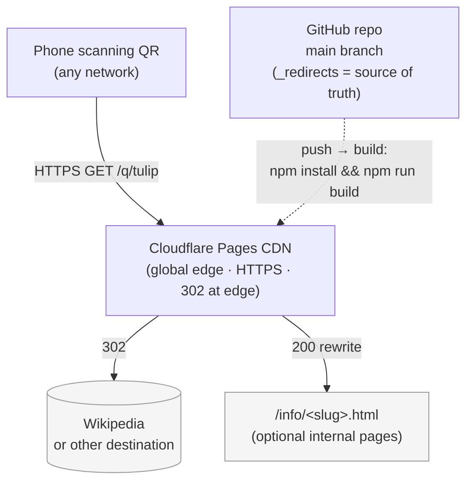

# QR Info — Static Implementation Plan

> **Related plan:** [admin-tool.md](admin-tool.md) — local browser-based
> tool for managing codes and deploying. Once that lands, `codes.json`
> becomes the source of truth and `_redirects` is generated from it; until
> then, `_redirects` is edited directly in git.

## Project Overview

A drastically simpler alternative to [../../basic_plan.md](../../basic_plan.md) (Pi
+ Next.js) and [../../secure-app/plans/securely-running-on-pi.md](../../secure-app/plans/securely-running-on-pi.md)
(production-hardened rewrite).

Instead of a server, a database, an admin UI, and a long security plan, this
version is **a static site + one `_redirects` file** hosted on Cloudflare
Pages (or Netlify). The CDN does real HTTP 302s at the edge. No backend, no
database, no auth, almost nothing to defend.

The headline feature of the dynamic system — **"print the QR once, repoint
later without reprinting"** — is preserved. Repointing is one line in
`_redirects` + a git push instead of an admin-UI click, but the encoded URL
on the plaque doesn't change.

### What this trades away vs. the Pi/Next.js plans

| Capability | Static (this plan) | Pi/Next.js |
|------------|--------------------|-----------:|
| Repoint a code | git edit + push (~1 min) | Admin UI (~10 sec) |
| Add a code | git edit + push | Admin form |
| Non-technical operator | ❌ (needs git) | ✅ |
| Browser-form info-page authoring | ❌ (HTML/MD by hand) | ✅ |
| Scan counter | External analytics (CF, Plausible) | Built-in |
| LAN-only / offline operation | ❌ | ✅ |
| Uptime | 99.99% (CDN's problem) | Home internet's problem |
| Setup time | ~30 min | Multi-day |
| Security surface | ~none | Substantial |
| Monthly cost | $0 (free tier) | $0 + Pi power |

If any row in the left column blocks the actual use case, switch to the Pi
plan. Otherwise this version is the right tool.

---

## Topology



- **Solid lines** = visitor traffic path. One hop from phone to CDN to
  destination. No origin server, no Pi in the loop.
- **Dotted line** = the build/deploy path. Every push regenerates the QR
  images against `CF_PAGES_URL` so the encoded URLs stay consistent across
  the site, including on freshly-printed plaques.

---

## Stack

| Concern | Choice |
|---------|--------|
| Hosting | Cloudflare Pages (free tier) |
| Source of truth for codes | `_redirects` file (one line per code) |
| Redirect handling | CDN edge, real HTTP 302 (no client JS) |
| TLS | Cloudflare-issued, auto-renewed |
| QR generation | `qrcode` npm package, run at build time |
| Landing pages | Plain HTML + embedded CSS (no framework, no build step beyond QR generation) |
| Optional analytics | Cloudflare Web Analytics (cookie-less, GDPR-friendly) |

---

## Project layout

```
qrinfo/
  static/
    _redirects          # source of truth: /q/<slug> → destination URL
    index.html          # landing page, lists the QR codes
    not-found.html      # fallback for unknown /q/* (Swedish)
    generate.mjs        # reads _redirects → writes qr/<slug>.png + .svg
    package.json        # one dev-dep: qrcode
    qr/                 # generated, git-ignored
    .gitignore
    README.md           # deploy / usage docs (operational)
    plan.md             # this file (execution tracking)
```

---

## Working agreements

- **`_redirects` is the single source of truth.** Edit it, push, the site
  rebuilds, QR images regenerate, edge routing updates. Never edit QR images
  by hand.
- **The encoded URL on a printed plaque is sacred.** Only ever change it if
  the hostname changes (e.g. moving from `*.pages.dev` to a custom domain).
  All other "changes" should be redirect-target changes in `_redirects`.
- **Keep this plan's progress up to date while executing** — tick checkboxes
  as work lands, annotate deltas inline. Same rule as
  [../../basic_plan.md](../../basic_plan.md).
- **No Node dependencies beyond `qrcode`.** Simplicity is the point. If a
  problem genuinely needs a framework, that's the signal to switch to the
  Pi/Next.js plan.
- **Test on a real phone after any plaque-affecting change.** The build can
  pass and the URL can 302 cleanly and the QR can still be unreadable due to
  contrast, size, or wear.

---

## Status — as of 2026-05-30

**Phases 0–4 are done.** Scaffold, QR generator, landing + fallback pages,
and local verification all complete. `npm install && QR_BASE_URL=… npm run
generate` produces level-H PNG + SVG pairs for every concrete `/q/<slug>`
entry parsed out of `_redirects`.

**Phases 5–6 are pending user action** — pushing to GitHub, setting up
Cloudflare Pages, and scanning a real plaque from a phone.

**Phases 7–9 are optional** — custom domain, analytics, more codes.

---

## Phases

---

### Phase 0 — Decide and scope
> Goal: confirm the static path is the right tool for the use case.

- [x] Compare static vs. Pi for the actual use case (two flowers → Wikipedia)
- [x] Confirm headline feature ("repoint without reprint") is preserved by
      static `_redirects`
- [x] Confirm no requirement for browser-based admin, built-in scan counter,
      or LAN-only operation in v1

---

### Phase 1 — Scaffold
> Goal: directory layout, source-of-truth redirect file, minimal package.

**Suggested agent:** `claude` (Sonnet 4.6)

- [x] Create `static/` directory
- [x] `_redirects` with the two flower entries + `/q/*` fallback
- [x] `package.json` (`type: module`, single dev-dep `qrcode`)
- [x] `.gitignore` covers `node_modules/`, `qr/*.png`, `qr/*.svg`
- [x] `qr/.gitkeep` so the output directory exists in the repo

---

### Phase 2 — QR generator
> Goal: PNG + SVG per code, generated against the deploy URL at build time.

**Suggested agent:** `claude` (Sonnet 4.6)

- [x] `generate.mjs` reads `_redirects`, extracts every concrete `/q/<slug>`
- [x] Base URL precedence: `QR_BASE_URL` → `CF_PAGES_URL` →
      `http://localhost:8080`
- [x] Level-H error correction + margin 2 (matches the Pi/Next.js defaults
      so plaques are interchangeable between deploys)
- [x] PNG and SVG emitted side-by-side under `qr/`
- [x] `npm run build` and `npm run generate` both invoke it

---

### Phase 3 — Landing + fallback pages
> Goal: a visitor who scans a valid code goes straight to the destination; a
> visitor who lands on the root or an unknown code sees a friendly page.

**Suggested agent:** `claude` (Sonnet 4.6)

- [x] `index.html` shows both QR images with Swedish labels (matches the
      [../../basic_plan.md](../../basic_plan.md) voice convention)
- [x] Mobile-first, system light/dark via `color-scheme`, no framework, no JS
- [x] `not-found.html` for unknown codes (Swedish copy)
- [x] `referrer="no-referrer"` so we don't leak the QR hostname to the
      destination

---

### Phase 4 — Local verification
> Goal: prove the generator works before touching the deploy.

**Suggested agent:** `claude` (Sonnet 4.6)

- [x] `npm install` succeeds
- [x] `QR_BASE_URL=https://example.pages.dev npm run generate` writes
      `qr/tulip.{png,svg}` and `qr/sunflower.{png,svg}`
- [x] Sanity-check generator output: both files present, non-empty, valid
      PNG / SVG headers


### Phase 4.1 — Pi-local end-to-end dry run
> Goal: run the **full flow** (admin tool → build → serve → phone-scan)
> on the Raspberry Pi over the LAN before any traffic touches Cloudflare.
> This is the dress rehearsal — same code paths, same data model, same
> URLs in QR codes; the only thing swapped is the hosting layer (Pi-LAN
> instead of CF edge).

**Suggested agent:** `claude` (Sonnet 4.6)

**Why a dry run on the Pi first:** the admin tool, the build, the
`_redirects` semantics, and the QR-encoding-against-deploy-URL pattern
have never been exercised end-to-end against a real phone yet. Doing it
on the Pi exposes anything wrong in the data flow *without* tying the
investigation to CF tokens, DNS, CF Access policies, or the
`production`/`staging` branch wiring. When this works on the LAN, the CF
migration is just changing the deploy target.

#### What we'd add (small, contained code change)

The admin tool's `lib/wrangler.mjs` is the only Cloudflare-specific
runtime piece. To serve `dist/` from the Pi we need a small **local
redirect server** that understands the subset of `_redirects` we emit
(per-slug 302 → URL, `/q/*` → fallback HTML, plain file serving).

- [x] Add `static/admin/lib/serve.mjs` — Node HTTP server that:
  - reads `dist/_redirects`, parses each line into a rule
  - on every request: matches against the rules; on match returns
    `302 location:<target>` (external) or rewrites/serves the file
    (`200` for internal HTML targets)
  - serves any other path from `dist/` as a static file
  - falls back to `not-found.html` for unknown `/q/*`
  - binds to `0.0.0.0:<port>` by default (override with
    `SERVE_HOST=127.0.0.1`)
- [x] Add `npm run serve` script (default port 8080,
      `SERVE_PORT=<n>` to override)
- [x] Verify locally: HEAD `/q/tulip` → 302 to Wikipedia;
      HEAD `/q/ghost` → 302 to `/not-found.html`; GET `/qr/tulip.png`
      → 200 image/png; path traversal blocked; end-to-end `curl -L`
      reaches the Wikipedia article. Same surface the CF edge will
      provide.

> The same `serve.mjs` is also useful in the laptop dev loop:
> `npm run build && npm run serve` previews `dist/` exactly as a phone
> on the LAN would see it, no CF account needed.

#### Driving the Pi from the admin tool

To run the full preview / deploy / rollback flow against the Pi instead
of CF, set `DEPLOY_TARGET=pi` + the `PI_*` env vars on the admin tool.
Implementation lives in `admin/lib/pi-deploy.mjs`; the dispatcher in
`admin/lib/deploy-target.mjs` picks it over `wrangler.mjs` at call time.

- [x] Add `lib/pi-deploy.mjs` implementing `pagesDeploy(dir, branch)` via
      tar-over-ssh + pm2, with separate per-branch services
      (`qrinfo-serve` for production on :8080, `qrinfo-staging` for the
      dark site on :8081)
- [x] Add `lib/deploy-target.mjs` selector (CF wrangler vs Pi)
- [x] Add `SERVE_DIST` env support to `serve.mjs` so two pm2 services
      can read different `dist/` directories on the same Pi
- [x] Verified end-to-end: `DEPLOY_TARGET=pi` admin tool → preview →
      `qrinfo-staging` running on :8081, `curl /q/tulip` → 302 to
      Wikipedia; production on :8080 untouched

#### Pi-side setup

- [ ] Install Node 20+ on the Pi (`curl -fsSL https://deb.nodesource.com/setup_20.x | sudo bash - && sudo apt install -y nodejs`)
- [ ] Clone the repo on the Pi:
      `git clone git@github.com:<you>/qrinfo.git /opt/qrinfo`
- [ ] Pick the Pi's LAN address. Two options, pick one:
  - **mDNS** — install `avahi-daemon`, hostname `qrpi.local` → site URL `http://qrpi.local:8080`
  - **Static LAN IP** — assign one in the router's DHCP reservation → site URL `http://192.168.x.y:8080`
- [ ] Decide which port — `8080` is fine; `:80` would need `setcap` or
      `authbind` since we're not running as root

#### Admin tool — where to run it during the dry run

Two valid setups; pick whichever the operator prefers:

- [ ] **A. Laptop admin → Pi serves.** Operator runs `npm run admin` on
      the laptop as usual. After every change:
      `git push` from laptop → `git pull && npm run build && pm2 restart qrinfo-serve` on the Pi.
      Closest to the eventual CF flow (admin = local, deploy target = remote).
- [ ] **B. SSH-tunnelled admin on the Pi.** Run `npm run admin` on the
      Pi (`OFFLINE=1` to skip pushes during testing). From the laptop:
      `ssh -L 5173:127.0.0.1:5173 pi@qrpi.local` then visit the printed
      `http://127.0.0.1:5173/<token>/` URL. Preserves the loopback-only
      safety guarantee; useful if the Pi is the only machine with the git
      checkout.

#### Pi service / autostart

- [ ] Install pm2 (or just systemd, matching the teacher project):
      `npm install -g pm2`
- [ ] Run the serve loop under pm2:
      `cd /opt/qrinfo/static && pm2 start "npm run serve" --name qrinfo-serve`
- [ ] `pm2 save && pm2 startup` so it survives a reboot
- [ ] Open the chosen port on UFW: `sudo ufw allow 8080/tcp`
- [ ] (Optional) put nginx in front on :80 so phones can omit the port —
      copy the teacher project's nginx snippet

#### Build the site against the Pi URL

- [ ] On the Pi (or from the laptop with the same env):
      `QR_BASE_URL_LOCAL=http://qrpi.local:8080 npm run build`
- [ ] Verify `dist/qr/tulip.png` and `dist/qr/sunflower.png` were
      regenerated with the Pi hostname encoded (the bytes change vs. the
      CF-target build — that's correct)
- [ ] Restart `qrinfo-serve` to pick up the new `dist/`

#### Phone-scan acceptance test (the actual goal)

- [ ] Phone on the same Wi-Fi as the Pi
- [ ] Print `dist/qr/tulip.png` (A6 or larger)
- [ ] Scan with iPhone — Wikipedia article opens, no interstitial
- [ ] Scan with Android — same
- [ ] Repeat for `sunflower.png`
- [ ] Scan an intentionally-disabled / fake-slug QR — phone lands on
      `not-found.html` cleanly
- [ ] **Run a rollback drill** in OFFLINE mode while traffic is on the
      Pi — confirm `release-state.json` updates, `dist/` rebuilds, and
      the next phone scan reflects the rolled-back content. This is the
      one thing that's harder to test post-CF because production traffic
      is real

#### What "done" looks like

- [ ] One operator can: add a code in the admin tool → commit → tag →
      deploy → see the new code resolve on a phone, with the Pi as the
      target
- [ ] Rollback in the same flow lands a phone scan back on the prior
      target within ~30 s of clicking
- [ ] Notes captured in [../runbooks/admin.md](../runbooks/admin.md) for
      anything Pi-specific (mDNS gotchas, port choice, pm2 commands)

#### Migrating from Pi to CF (after the dry run passes)

- [ ] Run `npm run build` with `QR_BASE_URL_PROD=<future-cf-hostname>` —
      this regenerates `dist/qr/*` for the eventual CF URL. **Critical:
      if any plaques were printed during the Pi dry run with
      `qrpi.local` encoded, they will not work after migration — reprint
      against the CF URL.**
- [ ] Continue with [Phase 5](#phase-5--deploy-to-cloudflare-pages):
      connect the CF Pages project, configure CF Access on the staging
      branch, point QR\_BASE\_URL\_PROD at the CF custom domain
- [ ] On the Pi, stop and disable `qrinfo-serve` (pm2 delete + remove
      from startup) so the Pi isn't quietly serving a stale copy

> Tear-down is intentionally cheap: `serve.mjs` and its `npm run serve`
> script can stay in the repo (still useful for laptop dev previews);
> only the pm2/nginx/UFW config on the Pi needs unwinding.

---

### Phase 5 — Deploy to Cloudflare Pages
> Goal: live on the public internet at a real HTTPS hostname.

- [ ] Push the `qrinfo` repo to GitHub (if not already there)
- [ ] Cloudflare dashboard → Pages → create project → connect GitHub repo
- [ ] Build settings:
  - **Build command:** `npm install && npm run build`
  - **Build output directory:** `static`
  - **Root directory:** `static` (or leave blank if you prefer working dir
    at repo root)
- [ ] Confirm first deploy succeeds; site renders at
      `https://<project>.pages.dev`
- [ ] `curl -I https://<project>.pages.dev/q/tulip` returns `HTTP/2 302` with
      `location: https://en.wikipedia.org/wiki/Tulip`
- [ ] Same for `/q/sunflower`
- [ ] `curl -I https://<project>.pages.dev/q/unknown-code` returns 302 →
      `/not-found.html`

---

### Phase 6 — Real phone scan verification
> Goal: a physical plaque actually works.

- [ ] Download `qr/tulip.png` from the deployed site, print at A6 or larger
- [ ] Scan with an iPhone — confirm Wikipedia article opens directly (302
      is followed without an interstitial)
- [ ] Scan with an Android — same
- [ ] Repeat for `qr/sunflower.png`
- [ ] (Sanity) scan from a slow / mobile-data connection — edge response is
      <100 ms

---

### Phase 7 — Optional: custom domain
> Goal: QR codes encode a clean, memorable URL instead of `*.pages.dev`.

> **Warning:** this is the only change after which **all previously printed
> plaques must be reprinted**, because the encoded URL changes. Do this
> *before* mass-printing plaques.

- [ ] Buy a domain (Cloudflare Registrar, Porkbun, Namecheap — ~$10/yr)
- [ ] Add the domain to Cloudflare; switch nameservers if not already there
- [ ] Pages project → Custom domains → add `qr.yourdomain.com`
- [ ] Set `QR_BASE_URL=https://qr.yourdomain.com` in the Pages project's
      environment variables
- [ ] Trigger a fresh deploy — `qr/*.png` and `qr/*.svg` regenerate against
      the new URL
- [ ] Reprint plaques against the new QR images

---

### Phase 8 — Optional: scan analytics
> Goal: visibility into how often each code is scanned.

- [ ] Enable Cloudflare Web Analytics on the Pages project (free, cookie-less,
      no GDPR banner required)
- [ ] Confirm scan events show up in the dashboard (resolver path = `/q/*`)
- [ ] (Optional) write a small dashboard query that aggregates by slug

If per-code counts in the operator's own UI become important, that's a
trigger to migrate to the Pi/Next.js plan — see
[When to switch to the Pi plan](#when-to-switch-to-the-pinextjs-plan) below.

---

### Phase 9 — Add more codes / internal info pages over time
> Goal: extend the site without rebuilding it.

**For an external redirect:**
- [ ] Add a line to `_redirects`: `/q/<slug>  <destination-url>  302`
- [ ] Commit + push — site rebuilds, new QR image appears at `/qr/<slug>.png`

**For an internal info page:**
- [ ] Hand-write `info/<slug>.html` (mobile-first, plain CSS — copy
      `not-found.html` as a template)
- [ ] Add to `_redirects`: `/q/<slug>  /info/<slug>.html  200`
      (status 200 = rewrite, keeps `/q/<slug>` in the URL bar)
- [ ] Optionally add the new card to `index.html`

**Either way:**
- [ ] Commit, push, wait for CF Pages build (~30 s)
- [ ] Print and phone-scan the new code

---

## When to switch to the Pi/Next.js plan

The static path is the right tool **until** one of these becomes a real
requirement:

- A **non-technical operator** must add or repoint codes from a browser.
  Static needs git; the Pi plan has an admin UI.
- **Scan counts must be visible to the operator inside this app**, not via
  an external analytics dashboard.
- **Authoring info pages must be form-based** (title + body) rather than
  hand-written HTML.
- **LAN-only / offline operation** is required (museum on a closed network,
  school internal-only).
- The operator needs to **disable a code instantly** without waiting for a
  CDN build (~30 s) — extremely unlikely to matter for printed-plaque use,
  but worth noting.

When one of these flips, the migration path is:
1. Build the Pi/Next.js stack from
   [../../secure-app/plans/securely-running-on-pi.md](../../secure-app/plans/securely-running-on-pi.md)
2. Import the existing `_redirects` entries into the Pi's database (one-time
   script)
3. Point DNS from CF Pages to the Pi-fronted hostname
4. The encoded URL on already-printed plaques stays the same → no reprint

That is, the static version is a low-risk way to start. None of the work
done here is wasted if you later need the dynamic system — `_redirects` is
trivially convertible to DB rows.

---

## Out of scope (this plan)

- Admin UI, authentication, sessions, CSRF, JWT — none of these exist by
  design
- Database, backups, restore drills — `_redirects` is the data; git history
  is the backup
- Pi host hardening, UFW, fail2ban, certbot — Cloudflare handles the edge
- Per-code rate limiting — Cloudflare Pages has platform-level rate limits
  that are more than enough for printed-plaque traffic
- Custom 404s beyond the friendly `not-found.html`
- Image uploads on info pages (hand-write `` tags in `info/<slug>.html`
  if needed)
